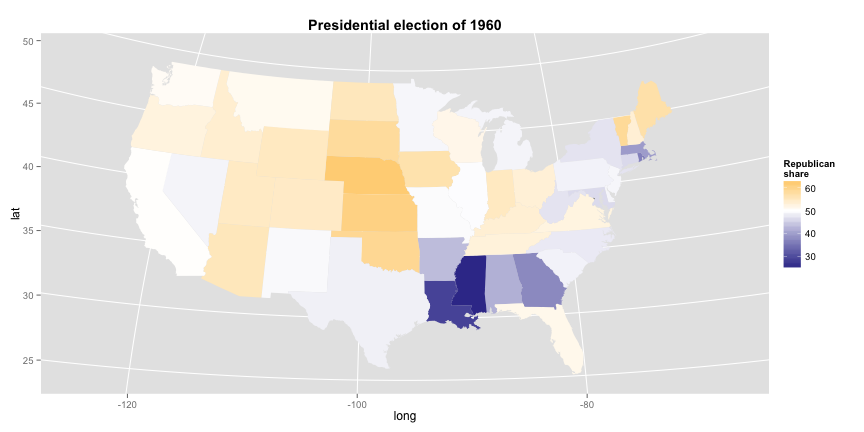

#### Last things first
This is the choropleth map that we produced in this session:



#### Choropleth maps
We learned to produce choropleth maps in ggplot2, along the way learning about some ggplot syntax.

These maps are drawn via the `geom_polygon` geometry, which draws each state as a polygon shape. We first need to import the shapefiles, which describe each state as a "connect the dots" series of lat/long points.

Happily, ggplot2 includes shapes for U.S. states and counties (among others). Import the state shapes:

```
library(ggplot2)
st = map_data('states')
```

