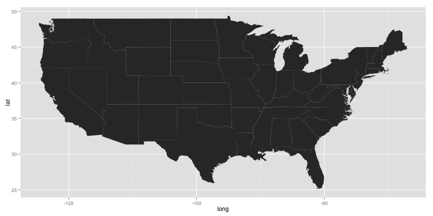
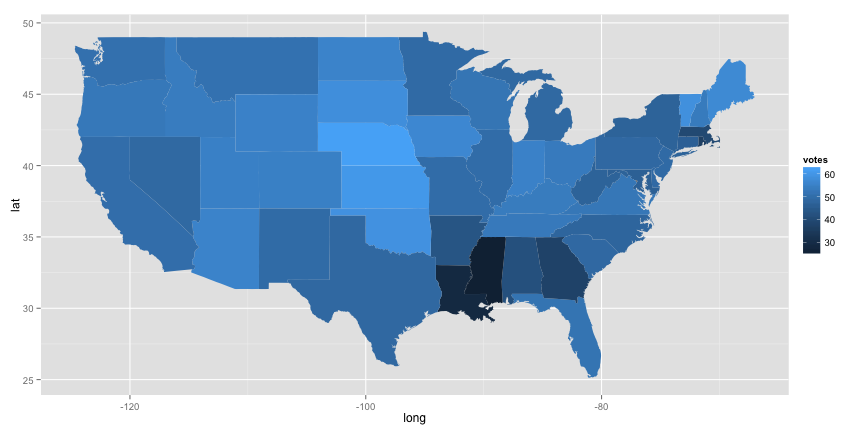

### Last things first
This is the choropleth map that we produced in this session:


### Choropleth maps
We learned to produce choropleth maps in ggplot2, along the way learning about some ggplot syntax.

These maps are drawn via the `geom_polygon` geometry, which draws each state as a polygon shape. We first need to import the shapefiles, which describe each state as a "connect the dots" series of lat/long points.


#### Getting started: drawing shapes
Happily, ggplot2 includes shapes for U.S. states and counties (among others). Import the state shapes and check out the top few rows:

```
library(ggplot2)
st = map_data('states')
head(st)
```

Gives the output:

           long      lat group order  region subregion
    1 -87.46201 30.38968     1     1 alabama      <NA>
    2 -87.48493 30.37249     1     2 alabama      <NA>
    3 -87.52503 30.37249     1     3 alabama      <NA>
    4 -87.53076 30.33239     1     4 alabama      <NA>
    5 -87.57087 30.32665     1     5 alabama      <NA>
    6 -87.58806 30.32665     1     6 alabama      <NA>

Now we build up the choropleth by layers. For the most basic plot (drawing the state outlines) the steps are:

 - Attach the data to a plot (`ggplot(st)`)
 - Establish the x and y variables, and indicate that the `group` column identifies the points that go together to draw each state (`aes(long, lat, group=group)`)
 - Tell ggplot2 that we're drawing polygons (`geom_polygon()`)
 
Putting it together:
 
```
map = ggpot(st) + aes(long, lat, group=group) + geom_polygon()
map
```

We get the image:




#### Adding meaningful colors:
Now add coloring based on the presidential election of 1960:

```
#Import the built-in votes.repub dataset
data(votes.repub)

#Grab the 1960 column and make the names lowercase to match the shapes:
vote = votes.repub[,'1960']
names(vote) = tolower(names(tovote))

#Now link the vote data to the state shapes by matching names:
st$votes = vote[st$region]

#Finally, add a color layer to the map:
map = map + aes(fill=votes)
map
```

This time, the map looks like:




#### Controlling the appearance:
Now we add the final touches: 

 - Adjust the color scheme to a blue-orange scale which goes to white at 50% (`scale_fill_gradient2(low=muted("blue"), mid="white", high="orange", name='Republican\nshare', midpoint=50)`)
 - Reproject from the default (Mercator) to Albers (`coord_map(project='globular')`)
 - Add a title (`theme(plot.title=element_text(face="bold"))`)

Putting these steps together:

```
map = map + scale_fill_gradient2(low=muted("blue"),
	mid="white", high="orange", midpoint=50,
	name='Republican\nshare')
map = map + theme(plot.title=element_text(face="bold"))
map + coord_map(project='globular') +
	ggtitle("Presidential election of 1960")
```

Gives us the map from the top of this post.